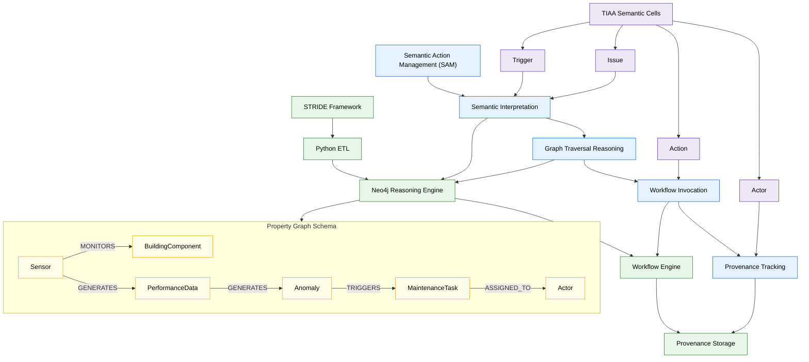

# 01_ontology_schema

本資料夾包含 SAM/STRIDE 框架之 **語義結構定義與圖模式（schema）**：

- Core ontology（以 Neo4j property graph 為主）
- 與 SOSA / IFC / PROV 等語意標準之對應（TTL）
- 建立 Neo4j schema 與基礎推理查詢之 Cypher 腳本

## 📖 對應論文章節與附錄  

本資料夾對應到論文的以下部分：

- **第 4 章 — 語意行動管理（SAM）方法論**  
  特別是 4.1（語意模型）、4.2（圖原生結構）、4.3（語意規則）。

- **第 5 章 — STRIDE 系統實作**  
  包含 PdM 與 SID-CM 案例的語意建模與 Neo4j schema。

- **第 6 章 — 評估方法與案例**  
  所有 traceability、多跳查詢、事件推理均依賴本 schema。

- **Appendix A — Ontology Schema（濃縮版）**  
  完整版本於本資料夾中。

---

# 📘 Semantic Architecture Overview（Mermaid 圖）

以下為 SAM／STRIDE ontology 在三層語意結構（TIAA → SAM → STRIDE）中的定位，並展示核心 Graph Schema（BuildingComponent, Sensor, PerformanceData, Anomaly, Task, Actor）。

> 此圖將同時用於 Appendix A.1 與研究簡報。



---

## 結構

```text
01_ontology_schema/
├─ cypher/
│  ├─ create_schema.cypher
│  ├─ constraints.cypher
│  ├─ example_queries.cypher
│  └─ reasoning_examples.cypher
├─ ttl/
│  ├─ interopbim-fm.ttl
│  ├─ sosa.ttl
│  ├─ prov.ttl
│  └─ README_ontology_mapping.md
├─ README.md
└─ schema_specification.md
```

## Neo4j Schema 建立

請先啟動 Neo4j，然後執行：

```bash
cypher-shell -u neo4j -p <password> -f 01_ontology_schema/cypher/create_schema.cypher
```

主要建立之節點與關係（摘錄）：

- Nodes: `BuildingComponent`, `Space`, `Sensor`, `PerformanceData`, `Anomaly`, `MaintenanceTask`, `WorkflowRun`, `Actor`  
- Relationships: `MONITORS`, `LOCATED_IN`, `GENERATES`, `TRIGGERS`, `RESOLVES`, `ASSIGNED_TO`, `HAS_PROVENANCE`  

## 本體對應（TTL）

`ttl/` 目錄中提供 RDF/TTL 風格之對應描述，用以說明：

- InterOpBIM-FM Ontology 與 IFC / FM 實體關聯  
- SOSA / SSN 觀測模型的對應（Sensor, Observation, FeatureOfInterest）  
- PROV-O 在 provenance chain 中的角色（Activity, Entity, Agent）  

這些 TTL 檔主要作為：

1. 說明性文件（documentation）  
2. 未來轉換成 RDF-store 或 hybrid graph（RDF + property graph）的基礎  

實際實驗與性能測試均在 Neo4j property graph 上完成。  

## 推理查詢範例

`cypher/example_queries.cypher` 提供基本查詢，如：

```cypher
// 查詢某設備最近一次異常及對應維護任務
MATCH (c:BuildingComponent {ComponentId:$cid})-[:HAS_SENSOR]->(:Sensor)-[:GENERATES]->(a:Anomaly)
OPTIONAL MATCH (a)-[:TRIGGERS]->(t:MaintenanceTask)
RETURN a, t
ORDER BY a.timestamp DESC
LIMIT 1;
```

`cypher/reasoning_examples.cypher` 則包含複合條件推理（例：能源 + 溫度異常整合）、重複異常資產偵測等，用於支援 PdM 案例。  
