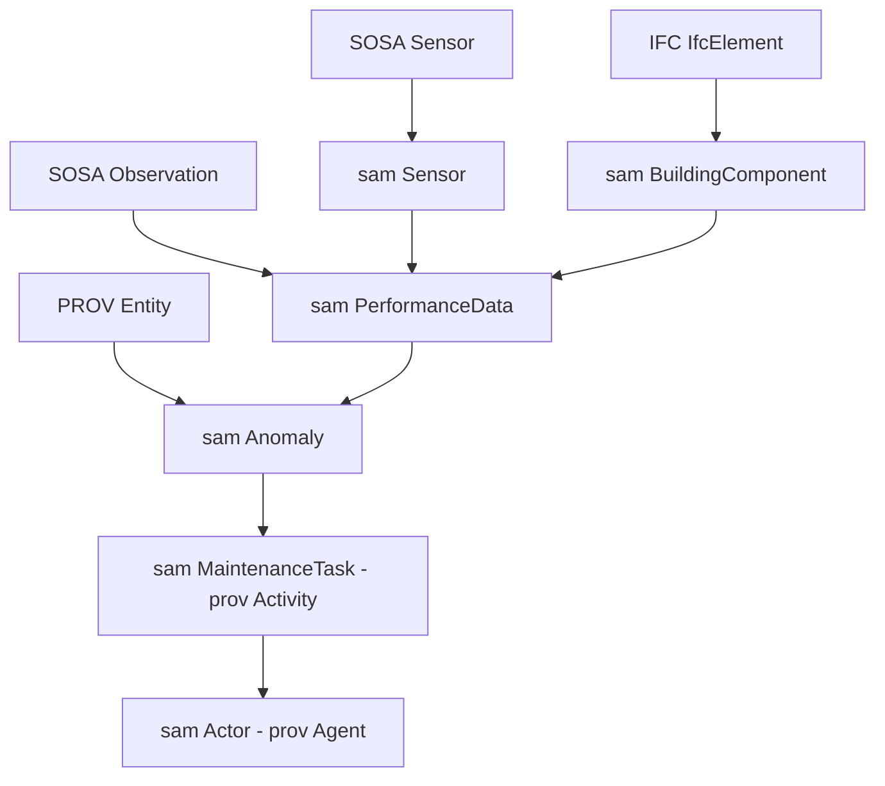

# Ontology Mapping Overview  
InterOpBIM–FM × SOSA/SSN × PROV-O × STRIDE/SAM

This document explains how the STRIDE/SAM ontology aligns with  
(1) IFC-based building information,  
(2) IoT sensing semantics (SOSA/SSN), and  
(3) provenance semantics (PROV-O).  

This mapping is used in:
- STRIDE semantic reasoning (PdM / FM automation)
- Appendix A (Ontology Schema) of the PhD dissertation
- Cross-domain data integration and explainability

---

# 1. IFC → InterOpBIM–FM → STRIDE/SAM Mapping

STRIDE 的 BuildingComponent、Space 與 Zone 等語意類別  
均源於 IFC 之室內外建築元素描述。

| STRIDE / SAM Class | IFC / BOT Equivalent | 說明 |
|---------------------|----------------------|------|
| `sam:BuildingComponent` | `ifc:IfcElement` | 維運／感測的實體 |
| `sam:Space` | `ifc:IfcSpace` | 具體空間單元 |
| `sam:Zone`  | `ifc:IfcZone` | 分區／系統空間 |

> 此對應允許 PdM 與 FM 應用中，  
> 將 BIM 萬物（Elements, Zones, Spaces）語意化轉換為可推理的 graph 节点。

---

# 2. SOSA/SSN → STRIDE/SAM Mapping（IoT Observations）

| STRIDE Class | SOSA Class | 說明 |
|--------------|-------------|------|
| `sam:Sensor` | `sosa:Sensor` | 量測裝置 |
| `sam:PerformanceData` | `sosa:Observation` | 觀測資料 |
| `sam:BuildingComponent` | `sosa:FeatureOfInterest` | 觀測所指涉的實體（HVAC component, pump…） |

核心語意關係：

Sensor--generates--> PerformanceData--about--> BuildingComponent

這使得 PdM 的異常偵測（Anomaly Detection）  
與後續行動觸發（Task Triggering）具備可追溯性。

---

# 3. PROV-O → STRIDE/SAM Mapping（Provenance / Traceability）

STRIDE workflow（Power Automate / n8n）與 anomaly–task–actor 的責任鍊使用 PROV-O 描述：

| STRIDE Entity | PROV Equivalent | 說明 |
|---------------|-----------------|------|
| `sam:PerformanceData` | `prov:Entity` | 觀測資料 |
| `sam:Anomaly` | `prov:Entity` | PdM 異常事件 |
| `sam:MaintenanceTask` | `prov:Activity` | 行動活動（維修任務） |
| `stride:WorkflowRun` | `prov:Activity` | 系統自動化流程 |
| `sam:Actor` | `prov:Agent` | 人或系統的代理人 |

語意鏈示例：

PerformanceData → Anomaly → MaintenanceTask → Actor
prov:Entity prov:Entity prov:Activity prov:Agent

此語意鏈支持：

- Explainable reasoning  
- Event-to-Action latency (TTA)  
- 完整 provenance chain reconstruction  
- Scenario debugging（PdM / Carbon workflows）

# 4. Combined Mapping Diagram

下圖呈現 IFC、SOSA/SSN、PROV 與 STRIDE/SAM 之間的跨層語意對位。  
Mermaid 圖示展示了資料如何從感測（Sensor）到觀測（PerformanceData）、  
再到事件（Anomaly）與後續行動（MaintenanceTask → Actor）之完整語意鏈。

此圖可視為本研究跨標準語意整合（Interoperability Layer）的核心結構，
同時支援 PdM（Predictive Maintenance）與碳管理（SID-CM）兩大應用場景。

---

# 5. Design Rationale

本語意對位設計遵循三項原則：

### 1. Minimal but Sufficient  
避免過度建模（heavy ontology），保留 FM/PdM 所需之最小語意集合。

### 2. Graph-Native Reasoning  
語意最終在 Neo4j 中以 property graph pattern 執行，而非 RDF 推理。  
TTL 為「可讀的語意文件（documentation）」。

### 3. Standards-Compatible  
必要時可輕鬆轉換至：
- RDF-star  
- SHACL  
- IFC-SODA  
- Knowledge Graph engines  

---

# 6. File List

本資料夾包含下列對位模型：

- interopbim-fm.ttl IFC → SAM core mapping
- sosa.ttl IoT semantics (SOSA minimal subset)
- prov.ttl Provenance semantics (PROV minimal subset)
- README_ontology_mapping.md ← 本文件

---

# 7. Notes for Future Extensions

可在下列方向延伸語意模型：

- 使用 RDF-star 補充 provenance（三元組層級註解）  
- 擴充 HVAC-specific schema（VAV, AHU components）  
- 套用 SHACL constraints 做資料驗證  
- 與 Neo4j Graph Data Science（GDS）結合  

---

# 8. Contact / Citation

如使用本語意模型，請引用：

**Huang, C.-P., & Hsieh, S.-H. (2026).  
Semantic Reasoning and Integration for Automating Predictive Maintenance in Smart Facility Management.  
Advanced Engineering Informatics.**
