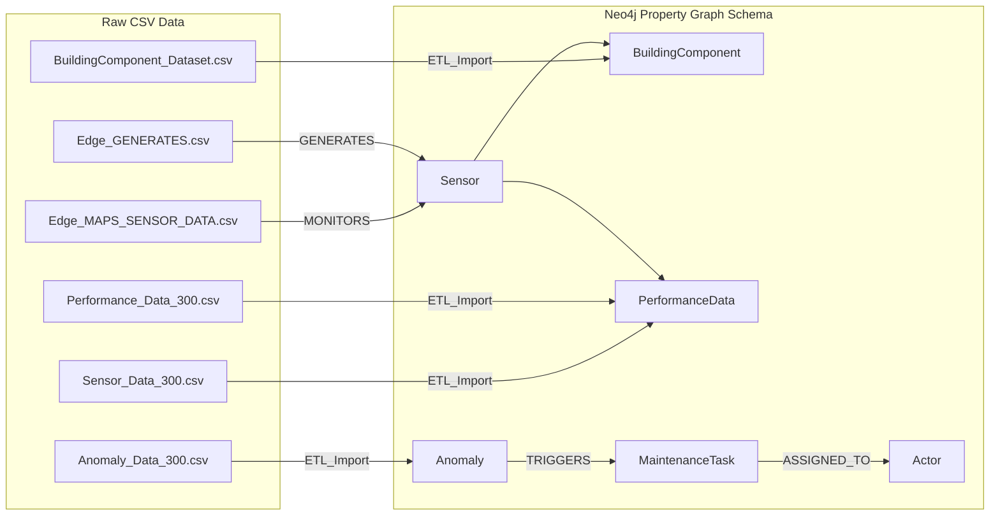

# 02_data — Case Datasets for STRIDE / SAM

本資料夾收錄本研究中用於驗證 **SAM / STRIDE 框架**之案例資料，
包含預測性維護（PdM / HVAC）與碳管理（SID-CM）之示例數據。
所有資料均為經過匿名化或合成之 demo 資料，目的在於支援：
1. 論文第 6 章案例之重現性；
2. 01_ontology_schema 中 Graph Schema 的實際載入；
3. 03_execution 與 04_validation 中 ETL、推理與效能實驗。

論文對應：
- **Ch. 5**：STRIDE 技術棧與語意推理實作（特別是 5.1–5.3 節）
- **Ch. 6**：PdM 與碳管理案例（HVAC / SID-CM）
- **Appendix B**：資料欄位與實驗設定（Data / Experimental Setup）

---

## 目錄結構

```text
02_data/
├─ PdM_HVAC/
│   ├─ raw/
│   │   ├─ Sensor_Data_300.csv
│   │   ├─ BuildingComponent_Dataset.csv
│   │   └─ README_PdM_raw.md
│   ├─ processed/
│   │   ├─ Performance_Data_300.csv
│   │   ├─ Anomaly_Data_300.csv
│   │   └─ README_PdM_processed.md
│   ├─ edges/
│   │   ├─ Edge_MAPS_SENSOR_DATA.csv
│   │   ├─ Edge_GENERATES.csv
│   │   └─ README_PdM_edges.md
│   ├─ tasks/
│   │   └─ MaintenanceTasks_Generated.csv
│   ├─ actors/
│   │   └─ Actors.csv
│   └─ README_PdM_overview.md
│
├─ Carbon_SIDCM/
│   ├─ raw/
│   │   ├─ Carbon_Material_Factors_demo.csv
│   │   ├─ Carbon_Component_BoQ_demo.csv
│   │   ├─ Carbon_Energy_Use_demo.csv
│   │   └─ README_Carbon_raw.md
│   ├─ processed/
│   │   ├─ SIDCM_Graph_Nodes_demo.csv
│   │   ├─ SIDCM_Graph_Relationships_demo.csv
│   │   └─ README_Carbon_processed.md
│   └─ README_Carbon_overview.md
│
└─ README.md   ← 本檔案
```

---

## 1. PdM / HVAC Case Datasets
### 1.1 raw/ — 感測與設備資料
#### 1.1.1 Sensor_Data_300.csv
高頻感測器輸入資料，用於模擬 HVAC 之 energy / temperature 等觀測值。

| 欄位名稱         | 型別     | 說明                              |
| ------------ | ------ | ------------------------------- |
| `event_id`   | int    | 觀測事件 ID（作為 PerformanceData 對應）  |
| `sensor_id`  | string | 感測器 ID（對應 Neo4j 中 `:Sensor`）    |
| `MetricName` | string | 觀測類型（如 `Energy`, `Temperature`） |
| `Value`      | float  | 觀測值                             |
| `Timestamp`  | string | 觀測時間（ISO 8601）                  |

對應圖模式：
```cypher
(:Sensor {sensor_id})-[:GENERATES]->(:PerformanceData {event_id})
```

#### 1.1.2 BuildingComponent_Dataset.csv
BIM / IFC 匯出的設備清單，用於建立 :BuildingComponent 節點。

| 欄位名稱              | 型別     | 說明                                   |
| ----------------- | ------ | ------------------------------------ |
| `GlobalId`        | string | IFC GlobalId，作為 BuildingComponent 主鍵 |
| `LastUpdatedDate` | string | 該設備最後更新日期                            |
| `TypeOfBC`        | string | 設備類型（如 AHU, Pump）                    |
| `Name`            | string | 設備名稱                                 |
| `Location`        | string | 位置描述（如 Building A / Zone）            |
| `Floor`           | string | 樓層                                   |
| `Sponsor`         | string | 所屬單位／維運責任組織                          |

對應圖模式：
```cypher
(:BuildingComponent {GlobalId, TypeOfBC, Name, ...})
```

---

### 1.2 processed/ — 數據整理與異常標註
#### 1.2.1 Performance_Data_300.csv
由 raw 觀測加上設備對映與時間切片後產生的性能資料。

| 欄位名稱           | 型別     | 說明                                             |
| -------------- | ------ | ---------------------------------------------- |
| `event_id`     | int    | PerformanceData ID（對應原始觀測）                     |
| `sensor_id`    | string | 感測器 ID                                         |
| `global_id`    | string | 建物設備 GlobalId（對應 `BuildingComponent.GlobalId`） |
| `MetricName`   | string | 觀測類型                                           |
| `Value`        | float  | 數值                                             |
| `update_start` | string | 數值起始時間（例如 aggregation window 起點）               |
| `update_end`   | string | 數值終止時間                                         |
| `date`         | string | 日期（方便查詢）                                       |
| `time_only`    | string | 時間（方便視覺化）                                      |

對應圖模式：
```cypher
(:Sensor)-[:GENERATES]->(:PerformanceData {event_id})-[:ABOUT]->(:BuildingComponent {GlobalId})`
```

#### 1.2.2 Anomaly_Data_300.csv
基於 PerformanceData 之推理或 AI 模型輸出的異常標註。

| 欄位名稱         | 型別     | 說明                                      |
| ------------ | ------ | --------------------------------------- |
| `p_id`       | int    | Anomaly ID（Primary Key）                 |
| `event_id`   | int    | 對應之 PerformanceData 事件 ID               |
| `sensor_id`  | string | 觸發此異常的感測器                               |
| `global_id`  | string | 所屬設備 GlobalId                           |
| `MetricName` | string | 相關量測類型                                  |
| `Value`      | float  | 觸發異常時的觀測值                               |
| `Timestamp`  | string | 異常發生時間                                  |
| `Anomaly`    | string | 異常類型（如 HighTemp, HighEnergy, Composite） |
| `ai_model`   | string | 若由 AI 模型偵測，則紀錄模型名稱（如 `IForest`）         |

對應圖模式：

```cypher
(:PerformanceData)-[:GENERATES]->(:Anomaly {p_id, Anomaly, ai_model})`
```

---

### 1.3 edges/ — Graph Relationships
#### 1.3.1 Edge_MAPS_SENSOR_DATA.csv
描述感測器與設備間的監測關係。

| 欄位名稱           | 說明                         |
| -------------- | -------------------------- |
| `Source`       | Sensor ID（sensor_id）       |
| `Target`       | BuildingComponent GlobalId |
| `Relationship` | 固定為 `MONITORS`             |

匯入 Neo4j 之後對應：

```cypher
(:Sensor {sensor_id:Source})-[:MONITORS]->(:BuildingComponent {GlobalId:Target})
```

#### 1.3.2 Edge_GENERATES.csv
描述感測器產生 PerformanceData 之關係。

| 欄位名稱           | 說明                         |
| -------------- | -------------------------- |
| `event_id`     | PerformanceData 事件 ID      |
| `sensor_id`    | 來源感測器 ID                   |
| `global_id`    | 所屬設備 GlobalId（冗餘欄位，方便查詢）   |
| `MetricName`   | 量測類型                       |
| `Value`        | 數值                         |
| `update_start` | 見 Performance_Data_300.csv |
| `update_end`   |                            |
| `date`         |                            |
| `time_only`    |                            |

在 Graph 中用來建立：

```cypher
(:Sensor {sensor_id})-[:GENERATES]->(:PerformanceData {event_id})
```

---

### 1.4 tasks/ — MaintenanceTasks_Generated.csv
為了支援 TIAA 中 Action 與 Actor 的推理，本研究根據異常類型自動生成示例工單資料。
| 欄位名稱                | 說明                             |
| ------------------- | ------------------------------ |
| `task_id`           | 工單 ID（如 `T0001`）               |
| `anomaly_id`        | 對應 `Anomaly_Data_300.p_id`     |
| `priority`          | 任務優先權（High / Medium / Low）     |
| `assigned_actor_id` | 指派之維運人員 ID（對應 Actors.csv）      |
| `status`            | 工單狀態（Open, InProgress, Closed） |
| `created_at`        | 建立時間                           |
| `due_at`            | 建議完成期限                         |

對應圖模式：

```cypher
(:Anomaly)-[:TRIGGERS]->(:MaintenanceTask)-[:ASSIGNED_TO]->(:Actor)
```

---

### 1.5 actors/ — Actors.csv（具名維運角色）
示例欄位：

| actor_id | name          | role       | team       |
| -------- | ------------- | ---------- | ---------- |
| Tech01   | Technician_01 | Technician | HVAC_Team  |
| Tech02   | Technician_02 | Technician | HVAC_Team  |
| Sup01    | Supervisor_01 | Supervisor | FM_Office  |
| AIA01    | AI_Agent_01   | AI-Agent   | AI_Service |

---

## 2. Carbon_SIDCM — Demo Data for Semantic Digital Thread (SID-CM)

本資料夾提供一組簡化的示例資料，用於展示：

 - 建築構件與材料清單（BoQ）
 - 材料碳因子（基於 ICE Database 樣式之合成資料）
 - 能源使用紀錄
 - 對應圖模式：`BuildingComponent → Material → CarbonFactor`，以及 `BuildingComponent → EnergyUse`。

### 2.1 raw/ Demo Schemas
#### 2.1.1 Carbon_Material_Factors_demo.csv

| 欄位名稱                     | 說明                  |
| ------------------------ | ------------------- |
| `material_code`          | 材料代碼                |
| `description`            | 材料說明                |
| `unit`                   | 單位（如 kg, m3）        |
| `factor_kgco2e_per_unit` | 單位碳排（kgCO₂e / unit） |
| `source`                 | 資料來源（如 `ICE_demo`）  |

#### 2.1.2 Carbon_Component_BoQ_demo.csv
| 欄位名稱            | 說明                                       |
| --------------- | ---------------------------------------- |
| `component_id`  | 對應 `BuildingComponent.GlobalId`          |
| `material_code` | 對應 Carbon_Material_Factors.material_code |
| `quantity`      | 數量                                       |
| `unit`          | 單位                                       |
| `stage`         | 生命週期階段（如 A1–A3, A4, A5）                  |

#### 2.1.3 Carbon_Energy_Use_demo.csv

| 欄位名稱          | 說明                              |
| ------------- | ------------------------------- |
| `timestamp`   | 用電時間                            |
| `meter_id`    | 電表或虛擬子系統 ID                     |
| `building_id` | 建築或區域 ID                        |
| `kwh`         | 用電量（kWh）                        |
| `scope`       | 範疇（如 `Operational`, `Embodied`） |


---

## 3. PdM Data Flow 與 Graph Schema（Mermaid）

以下 Mermaid 圖說明 PdM 資料如何從 raw CSV 經由 ETL 進入 Neo4j 的 Property Graph Schema，
並對應到語意行動管理流程。


