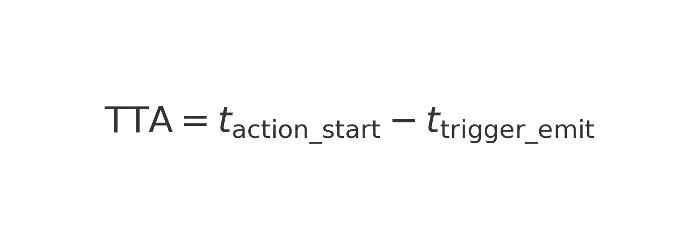
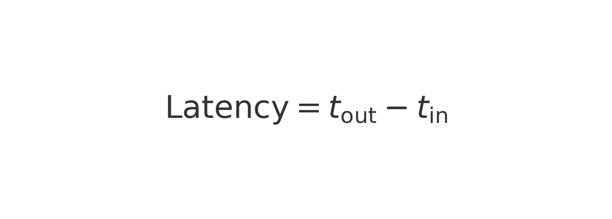
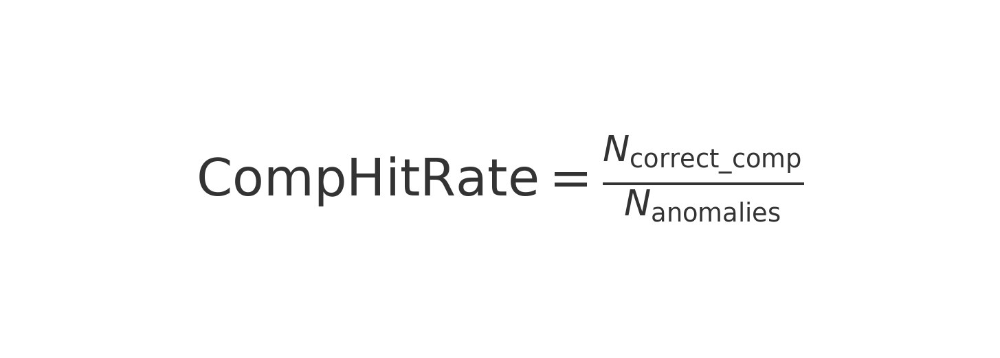

# 指標定義（Evaluation Metrics）— 中文完整版

本文件定義本研究於 語意行動管理（SAM）與 STRIDE 系統驗證中所使用的全部評估指標。
所有指標皆對應論文第 **5 章（框架評估）**與第 6 章（案例驗證），並由
compute_metrics.py 自動計算。

### 📌 論文對應

 - 第 5.3 節：事件驅動效能
 - 第 6.1 節：HVAC PdM 自動工單派發
 - Appendix B：指標定義

## 🧩 1. 事件至行動延遲（TTA, Time-to-Action）

事件觸發到系統開始採取行動（如建立工單、啟動工作流）所需的時間差。

### 📌 定義（含 inline 公式圖片）

### 📌 量測方式

 - trigger_emit 來自 Sensor / PerformanceData / Anomaly 之 Timestamp
 - action_start 來自 Power Automate / n8n workflow log
 - compute_metrics.py 會自動比對同一 event_id 的兩者時間戳

## ⚡ 2. 延遲（Latency）— 系統處理一個事件所需時間

反映事件從「進入管線 → 推理 → 行動」的整體處理效率。

### 📌 公式

### 📌 量測方式

 - t_in：事件進入 Neo4j / Rule Engine 的時間
 - t_out：工作流完成第一個輸出的時間
 - 以 workflow_log 取得

## 📈 3. 吞吐量（Throughput）— 單位時間可處理事件數量

衡量 STRIDE + Neo4j + 工作流 pipeline 的整體負載能力。

### 📌 公式

### 📌 量測方式

 - 模擬以固定速率匯入 Sensor_Data
 - 計算 unit time 中成功處理的事件數

## 🕳 4. 遺失率（Loss Rate）— 事件掉失比例

反映事件驅動架構的可靠性。若事件掉失會造成：
 - PdM 異常偵測錯誤
 - 任務漏派、漏通知
 - Carbon SID-CM 計算錯誤

### 📌 公式

### 📌 量測方式

 - N_in：匯入事件（Sensor / PerformanceData 數量）
 - N_out：Neo4j 中成功建立之 PerformanceData / Anomaly / Task
 - 用 compute_metrics.py 自動比較

## 🔄 5. 補償命中率（Compensation Hit Rate）

補償流程（Compensation Workflow）啟動成功之比例。
此指標關係到系統的 高可靠性（High Reliability）。

### 📌 公式

### 📌 量測方式

 - 使用 compensation_log.csv
 - 當事件導致 workflow failure 時，是否啟動備援行為
 - 高可靠系統應達：95–100%（本研究採 A 方案）

## 🚀 6. 可移植性（Portability）— 跨場域重部署成功率

衡量 STRIDE 是否能在不同 domain（PdM → Carbon SID-CM）重複使用。

### 📌 公式

### 📌 量測方式

比較：

 - HVAC PdM Pipeline
 - Carbon SID-CM Pipeline
當資料源 / 規則集 / 任務類型更換時，系統是否仍能運作。

## ✔ 指標總表

| 指標                    | 說明        | 來源                 |
| --------------------- | --------- | ------------------ |
| TTA                   | 事件到行動延遲   | workflow log       |
| Latency               | 單一事件處理時間  | workflow log       |
| Throughput            | 單位時間事件處理數 | IoT stream 模擬      |
| Loss Rate             | 事件掉失比例    | Neo4j vs. raw data |
| Compensation Hit Rate | 補償流程成功比例  | compensation_log   |
| Portability           | 跨場域成功率    | PdM & SIDCM        |

## 📘 引用文獻（中文摘要）

本文件所有指標之定義參考以下領域文獻：
 - Event-Driven Architecture（EDA）效能衡量
 - Complex Event Processing（CEP）延遲 / 吞吐量模型
 - BPMN Compensation Model
 - PROV-O 資訊來歷模型
 - ISO 19650 資訊治理夾構
 - BS EN 15978 生命週期碳評估標準

## 📎 與 STRIDE/SAM 模組的對位

| 指標                      | 對應 SAM 階段           | 對應 STRIDE 層                 |
| ----------------------- | ------------------- | --------------------------- |
| TTA                     | Workflow            | Automation Layer            |
| Latency                 | Semantic + Workflow | Integration & Orchestration |
| Throughput              | 全流程                 | ETL / Neo4j / Workflow      |
| Loss Rate               | Semantic            | ETL / Event Pipeline        |
| Traceability（透過 Cypher） | Provenance          | Governance Layer            |
| Compensation            | Workflow            | Automation Layer            |
| Portability             | Semantic Model      | 全框架                         |

