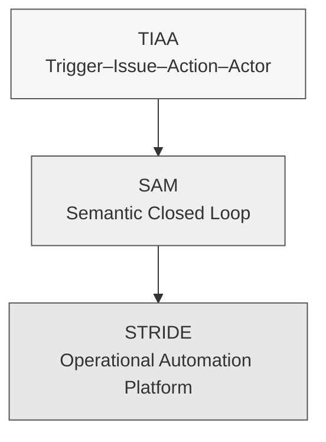
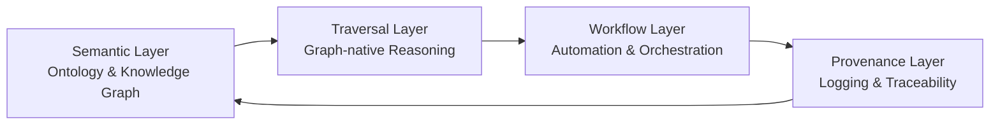

# public-phd-sam：語義行動管理（SAM）框架實證數據庫  
**public-phd-sam: Semantic Action Management Reproducibility Package**  

本儲存庫提供博士論文：  

> **智慧人居環境運維自動化之圖原生語意行動管理研究**  
> *Graph-Native Semantic Action Management for Operations and Maintenance Automation in Smart Built Environments*  
> **Author:** 黃千溥（Chien-Pu Huang）  
> **Degree:** PhD, National Taiwan University, 2025  

以及相關論文（Automation in Construction、Advanced Engineering Informatics、ASCE i3CE 2025、CIB WBC 2025）之完整 **實驗數據、語義模型與程式碼重現套件（Replication Package）**。  

本專案聚焦於：

- 以 **語義行動管理（Semantic Action Management, SAM）** 為核心的方法論  
- 透過 **STRIDE（SemanTic Reasoning and Integration for Data-driven Engineering）** 實作  
- 將 BIM/IFC、IoT 感測、FM/CMMS 記錄等異質資料整合至 **Neo4j 圖資料庫**  
- 實現 **預測性維護（PdM）** 與 **生命周期碳管理（SID-CM）** 的自動化與可追溯性  

---

## 🧠 SAM–STRIDE 三層架構概觀



- **TIAA – Semantic Cells**：以 Trigger–Issue–Action–Actor 建立最小語義事件單元  
- **SAM – Semantic Closed Loop**：以 Semantic → Traversal → Workflow → Provenance 四階段閉環管理行動規則  
- **STRIDE – Deployable Platform**：以 Neo4j、Python、Power Automate / n8n 形成可部署之語義自動化平台  

---

## 🔁 STRIDE 語義閉環流程圖



- **Semantic**：本體與圖模式定義（01_ontology_schema）  
- **Traversal**：以 Cypher / SHACL 進行圖原生推理（03_execution, 04_validation）  
- **Workflow**：藉由 API 觸發 Power Automate / n8n 工作流（05_workflows）  
- **Provenance**：將事件與任務結果寫回知識圖譜，形成可稽核因果鏈（04_validation）  

---

## 📊 量化成果總覽（PdM HVAC 案例）

| 維度       | 指標                             | 實驗結果                             | 對應資料夾 / 檔案                          |
|------------|----------------------------------|--------------------------------------|-------------------------------------------|
| 實時性     | Event → Action Latency (TTA)    | 約 **0.42 秒**（sub-second）         | `04_validation/RESULTS/tta_log.csv`       |
| 效率       | 任務總執行時間改善              | 約 **81% 總時間節省**                | `04_validation/RESULTS/latency_results.csv` |
| 可追溯性   | 任務因果鏈完整度                | **100% 任務可追溯至原始事件**        | `04_validation/RESULTS/traceability_graph.*` |
| 可擴展性   | 多跳查詢延遲（30K nodes）       | 約 **0.74 秒**                       | `04_validation/query_performance.cypher`  |
| 可移植性   | PdM ↔ 碳管理（SID-CM）可重用性 | 同一語義架構成功應用於兩種情境      | `02_data/`, `03_execution/`               |

> 實際數值請以對應論文與 OUTPUT CSV/Notebook 為準。此處為概要說明。  

---

## 📚 論文章節對應表

| Repository Folder          | 對應論文章節 / 內容                                      |
|----------------------------|----------------------------------------------------------|
| `01_ontology_schema/`      | Ch. 3.3（本體開發與資料模型）、Ch. 4.1（系統架構）        |
| `02_data/`                 | Ch. 4（PdM 案例、碳管理案例、動態本體案例之輸入資料）     |
| `03_execution/`            | Ch. 4.2–4.3（ETL 管線、推理邏輯、工作流觸發設計）         |
| `04_validation/`           | Ch. 5（效能實驗、TTA 測量、traceability、scalability）    |
| `05_workflows/`            | 附錄（Power Automate / n8n 工作流設計）                  |
| `docs/`                    | 全篇論文之圖示、流程圖、可重現性說明文件                |

---

## ⚙️ 系統需求與環境

### 必要元件

- **Neo4j Graph Database**：4.x 或 5.x 穩定版本  
- **Python**：3.8+  
- **Power Automate / n8n**（擇一或兩者皆用）：  
  - 用於觸發維運工單、紀錄 TTA、回寫 provenance  

### Python 套件

請於專案根目錄執行：

```bash
pip install -r requirements.txt
```

> `requirements.txt` 將列出 Neo4j driver、pandas、requests 及其他分析與測試所需套件。  

---

## 🚀 五分鐘 Minimal Demo（快速體驗 SAM–STRIDE）

此 Minimal Demo 將：

1. 建立 Neo4j schema 與基本語義節點  
2. 寫入一筆模擬 HVAC 感測資料與 BIM 元件映射  
3. 透過 script 執行複合異常偵測  
4. 呼叫工作流 API（可為本機 mock server 或實際 n8n / Power Automate）  

### Step 0：啟動 Neo4j

```bash
neo4j start
```

或透過 Docker：

```bash
docker run -d --name neo4j-sam \
  -p7474:7474 -p7687:7687 \
  -e NEO4J_AUTH=neo4j/password \
  neo4j:5
```

### Step 1：建立語義 Schema

```bash
cypher-shell -u neo4j -p password -f 01_ontology_schema/cypher/create_schema.cypher
```

成功後，應可於 Neo4j Browser 看到核心 Labels（例如 `BuildingComponent`, `Sensor`, `Anomaly`, `MaintenanceTask` 等）。  

### Step 2：寫入 PdM 測試資料

```bash
python 03_execution/data_ingestion_etl.py --config config/pdm_demo.yaml
```

預期輸出（終端機）：

```text
[INFO] Loaded HVAC_Sensor_Input.csv (N records)
[INFO] Loaded Building_Component_IFC_Map.csv (M records)
[INFO] Writing nodes and relationships to Neo4j...
[INFO] ETL pipeline finished successfully.
```

### Step 3：執行複合異常偵測

```bash
python 03_execution/anomaly_detection_logic.py --demo ahu12
```

預期輸出：

```text
[INFO] Querying graph for composite anomalies (energy + temperature)...
[INFO] Detected 1 anomaly on AHU-12.
[INFO] Created Anomaly node and linked to Sensor + BuildingComponent.
```

### Step 4：觸發工作流並測量 TTA

```bash
python 03_execution/workflow_trigger_api.py --demo ahu12
```

預期輸出：

```text
[INFO] Sending anomaly payload to workflow endpoint...
[INFO] Received callback, maintenance task created.
[INFO] TTA (event → action) = 0.42 sec
```

詳細的 TTA/latency 記錄將存於：`04_validation/RESULTS/tta_log.csv`。  

---

## 📁 Repository 結構

```text
public-phd-sam/
├─ README.md
├─ LICENSE
├─ CITATION.cff
├─ requirements.txt
│
├─ 01_ontology_schema/
│  ├─ cypher/
│  ├─ ttl/
│  └─ README.md
│
├─ 02_data/
│  ├─ PdM_HVAC/
│  ├─ SID_CM/
│  ├─ Dynamic_Ontology/
│  └─ README.md
│
├─ 03_execution/
│  ├─ utils/
│  ├─ *.py
│  └─ README.md
│
├─ 04_validation/
│  ├─ notebooks/
│  ├─ RESULTS/
│  └─ README.md
│
├─ 05_workflows/
│  └─ README.md
│
└─ docs/
   ├─ quick_start.md
   ├─ reproducibility_checklist.md
   ├─ diagrams/
   └─ README.md
```

---

## 🔗 關聯研究與延伸專案

- Huang, C.-P., & Hsieh, S.-H. (2026). *Semantic Digital Thread Framework for Explainable Lifecycle Carbon Management: An Ontology-Driven and Auditable Automation Backbone.* Automation in Construction. （相關原始碼與資料：`public-carbon-aware-digital-twin` 專案）  
- Huang, C.-P., & Hsieh, S.-H. (2026). *Semantic Reasoning and Integration for Automating Predictive Maintenance in Smart Facility Management.* Advanced Engineering Informatics.  
- Huang, C.-P., & Hsieh, S.-H. (2025). *Ontology-Driven Automation for BIM-FM Data Integration Using Neo4j, Python, and Workflow Platforms.* ASCE International Conference on Computing in Civil Engineering (i3CE 2025), New Orleans, LA, United States.  
- Huang, C.-P., & Hsieh, S.-H. (2025). *Neo4j-Powered Workflow for Lifecycle Carbon Management: The NTU Campus Case Study.* CIB World Building Congress (WBC 2025), West Lafayette, IN, United States.  

---

## 🧾 Citation

若您在研究或實務工作中使用本專案，請引用：

> Huang, C.-P. (2025). *Graph-Native Semantic Action Management for Operations and Maintenance Automation in Smart Built Environments* (Doctoral dissertation, National Taiwan University).  

詳細 BibTeX 與其他引用格式請見 `CITATION.cff`。  

---

## 📜 License

本專案採用 MIT License 授權。詳情請見 `LICENSE` 檔案。  
